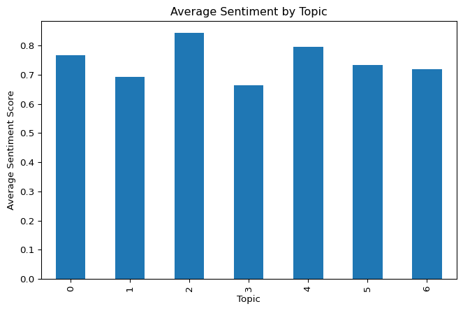
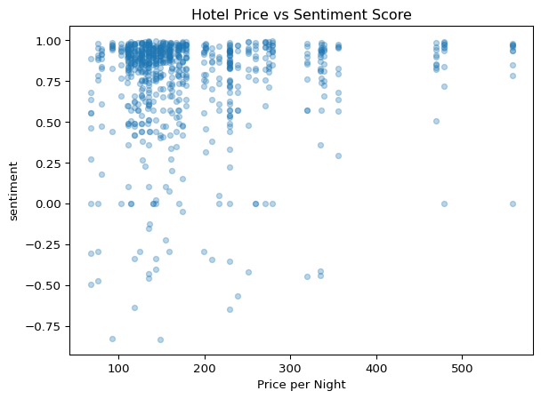
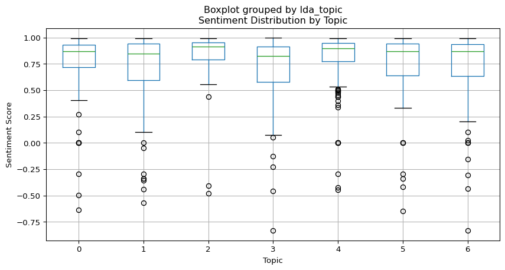

# Untitled


This repository explores what customers value in hotel stays by
analyzing Booking.com hotel data for Chicago. The broader goal of the
project is to extract, clean, and analyze unstructured text
data-specifically customer reviews in order to uncover the topics guests
most frequently mention, measure the sentiment behind those comments,
and see whether hotel price influence the tone of reviews. To complete
the analysis, the project proceeds in several stages: 1-Web Scraping of
Hotel Data

This script automates the process of collecting publicly available hotel
data from Booking.com. Since bookin.com loads search results
dynamically, the scraper uses Playwright’s asynchronous API to fully
render the page before extracting information.

``` python
import pandas as pd
from playwright.sync_api import sync_playwright, Playwright
import re
import asyncio
from playwright.async_api import async_playwright


async def main():
    async with async_playwright() as pw:

        browser = await pw.chromium.launch(headless=False)
        page = await browser.new_page()

        await page.goto("https://www.booking.com/searchresults.html?ss=Chicago&checkin=2025-12-12&checkout=2025-12-13&lang=en-us")

        await page.wait_for_selector('div[data-testid="property-card"]') #Booking loads hotels dynamically

        hotels = page.get_by_test_id('property-card')
        hotel_count = await hotels.count()
        print(hotel_count)


        hotel_list = []

        #Loop through each hotel
        for i in range(hotel_count):
            hotel = hotels.nth(i)
#NAME
            name = None
            if await hotel.get_by_test_id('title').is_visible():
            #if await hotel.locator('div[data-testid="title"]').is_visible():
                name = await hotel.get_by_test_id('title').inner_text()
                #name = await hotel.locator('div[data-testid="title"]')


#Rating
            rating = None

            if await hotel.get_by_test_id('review-score').is_visible():
                review_text = await hotel.get_by_test_id('review-score').inner_text()
            
                lines = review_text.split('\n')

                if len(lines) >= 1: 
                    rating = lines[0].strip()
                if len(lines) >= 2:
                    count_reviews = re.sub(r'\D', '', lines[1].strip())
#PRICE
            price = None
            price_element = hotel.get_by_test_id('price-and-discounted-price').first 
            
            if await price_element.is_visible():
                price_text = await price_element.inner_text()
                price = re.sub(r'[^0-9]', '', price_text)

           

#DATAFRAME
            hotel_df = pd.DataFrame({
                "Name": [name],
                "Rating": [rating],
                "Number of Reviews": [count_reviews],
                "Price per Night": [price]
            })
            hotel_list.append(hotel_df)
#COMBINE ALL 
        hotel_results = pd.concat(hotel_list, ignore_index=True)

#SAVE TO CSV
        hotel_results.to_csv("booking_hotels_chi.csv", index=False)
        await browser.close()


asyncio.run(main())
```

2-Extraction of Customer Reviews This script collects customer review
text for each hotel listed in booking_hotels_chi.csv. Because
Booking.com loads reviews dynamically and hides them, the script also
uses Playwright;s asynchronous API to enter each hotel page, click the
“Read all Reviews” button, scroll through the page to load additional
reviews, and extract the text content of each review card. For every
hotel the script collects: Review title Positive Comments Negative
Comments (All if available). All reviews are appended into a structured
list and finally exported as booking_hotel_reviews_chi.csv, which serves
as the primary text dataset for the project’s sentiment analysis and
topic modeling. This file represents the core unstructured data
collection for the project.

``` python
import asyncio
from playwright.async_api import async_playwright
import pandas as pd
import time

async def scrape_reviews():

    hotels = pd.read_csv("booking_hotels_chi.csv")

    reviews_list = []

    async with async_playwright() as pw:
        browser = await pw.chromium.launch(headless=False)
        page = await browser.new_page()

        # Loop through all hotels
        for idx, row in hotels.iterrows():
            hotel_name = row["Name"]
            hotel_url  = row["URL"]


            # Go to hotel page
            await page.goto(hotel_url, timeout=60000)
            await asyncio.sleep(3)

            # Scroll 
            await page.mouse.wheel(0, 2000)
            await asyncio.sleep(1.5)

            # Read all reviews button
            review_button = page.locator("button[data-testid='fr-read-all-reviews']")

            #In case one of the hotels does not have a reall all reviews button
            if await review_button.count() > 0:
                await review_button.first.scroll_into_view_if_needed()
                await asyncio.sleep(0.5)
                await review_button.first.click()
                await asyncio.sleep(3)
            else:
                print("No button")
                continue

            # Scroll inside to load more reviews
            for _ in range(5):
                await page.mouse.wheel(0, 4000)
                await asyncio.sleep(1)

            # Select all review cards
            cards = await page.query_selector_all("div[data-testid='review-card']")

            for card in cards:
                parts = []   # We will add title + positive + negative

                #Title
                title_el = await card.query_selector("h4[data-testid='review-title']")
                if title_el is not None:
                    title_text = (await title_el.inner_text()).strip()
                    if title_text:
                        parts.append(title_text)

                #Positive Text
                pos_el = await card.query_selector("div[data-testid='review-positive-text']")
                if pos_el is not None:
                    pos_text = (await pos_el.inner_text()).strip()
                    if pos_text:
                        parts.append(pos_text)

                #Negative Text
                neg_el = await card.query_selector("div[data-testid='review-negative-text']")
                if neg_el is not None:
                    neg_text = (await neg_el.inner_text()).strip()
                    if neg_text:
                        parts.append(neg_text)

                # Combine the three pieces of reviews into one single text block
                full_text = " ".join(parts) if parts else None

                reviews_list.append({
                    "Hotel Name": hotel_name,
                    "Review": full_text
                })

        # Close browser
        await browser.close()

        # Save all reviews to CSV
        df = pd.DataFrame(reviews_list)
        df.to_csv("booking_hotel_reviews_chi.csv", index=False)


asyncio.run(scrape_reviews())
```

3- Cleaning and Sentiment Analysis This script performs the
preprocessing required to transform raw review text into a clean,
structured dataset suitable for topic modeling and sentiment analysis.
It performs the third major step of the project: transforming raw
Booking.com reviews into clean, analyzable text and assigning sentiment
scores based on review content. It loads the scraped hotel reviews and
metadata, removes noise (HTML tags, encoding errors, stopwords), applies
VADER sentiment analysis to assign sentiment scores, and merges
sentiment results with hotel level attributes. The output is
merged_hotel_reviews_chi.csv which contains clean review text, sentiment
scores, hotel data, and price information. This is the primary dataset
used for modeling and visualization in the final analysis.

``` python
import pandas as pd
import re
import string
from vaderSentiment.vaderSentiment import SentimentIntensityAnalyzer


reviews = pd.read_csv(
    "C:/Users/Alejandra Palomo/Unstructured Data/Final Project/booking_hotel_reviews_chi.csv",
    encoding="latin1"
)

hotels = pd.read_csv(
    "C:/Users/Alejandra Palomo/Unstructured Data/Final Project/booking_hotels_chi.csv",
    encoding="latin1"
)

stopwords = {"the","and","is","to","it","in","that","was","for","of","with",
    "this","but","on","we","they","be","as","are","at","you","i","so",
    "had","have","were","my","our","me","from","or","by","an","not","all","there"}

sample = reviews["Review"].loc[0]
print(sample)

#Convert to string 
sample_string = str(sample)
sample_string 

#Remove NA from the reviews
sample_no_na = re.sub(r"\bNA\b", "", sample_string)
print(sample_no_na)

#Remove html tags 
sample_no_html = re.sub(r"<.*?>", "", sample_no_na)
print(sample_no_html)

#Remove stopwords
no_stpwrds = sample_no_html.split()
words_no_stop = [w for w in no_stpwrds if w not in stopwords]
sample_clean_final = " ".join(words_no_stop)
print(sample_clean_final)


def clean_review(text):
    text = str(text).strip()
    try:
        text = text.encode("latin1").decode("utf-8")
    except:
        pass

    text = re.sub(r"<.*?>", "", text)
    text = re.sub(r"\b(NA|N/A|Na|na|null)\b", "", text, flags=re.IGNORECASE)
    text = re.sub(r"ðŸ\w*", "", text)
    text = text.encode("ascii", "ignore").decode()

    text = re.sub(r"\s+", " ", text).strip()
    

    words = text.split()
    words_no_stop = [w for w in words if w not in stopwords]

    return " ".join(words_no_stop)

reviews["cleaned_review"] = reviews["Review"].apply(clean_review)

# Remove original messy review column
reviews = reviews.drop(columns=["Review"])

#Sentiment Analysis 
vader = SentimentIntensityAnalyzer()

def get_sentiment(text):
    return vader.polarity_scores(str(text))['compound']

reviews["sentiment"] = reviews["cleaned_review"].apply(get_sentiment)


#Merge and save to csv
merged = reviews.merge(
    hotels,
    left_on="Hotel Name",   # column from reviews
    right_on="Name",        # column from hotels
    how="left"
)

merged = merged.drop(columns=["Name"])
merged.to_csv("merged_hotel_reviews_chi.csv", index=False)
```

4-Topic Model This script performs topic modeling on the cleaned hotel
review text using LDA. After vectorizing the reviews with a bag-of-words
representation, the model identifies clusters of words that represent
recurring themes in guest experiences. Each review is then assigned to
its most likely topic, and the results are saved as
merged_hotel_reviews_with_topics.csv.This step allows the project to
uncover what guests talk about most, and forms the basis for
interpreting sentiment differences across topics and relating themes to
price.

``` python
from bertopic import BERTopic
from bertopic.vectorizers import ClassTfidfTransformer
# joblib is for saving and loading objects
from joblib import load, dump
import pandas as pd
import numpy as np

# gensim is for LDA
import lda

import pandas as pd
import pprint as pprint

import requests

from sklearn.feature_extraction.text import CountVectorizer

merged = pd.read_csv("C:/Users/Alejandra Palomo/Unstructured Data/Final Project/merged_hotel_reviews_chi.csv")

merged.head()
merged["cleaned_review"].head()

vectorizer = CountVectorizer(stop_words="english")
X = vectorizer.fit_transform(merged["cleaned_review"]) 

#LDA MODEL
model = lda.LDA(n_topics=7, n_iter=500, random_state=1)
model.fit(X)

topic_word = model.topic_word_
vocab = vectorizer.get_feature_names_out()
n_top_words = 10

for i, topic_dist in enumerate(topic_word):
    top_idx = topic_dist.argsort()[-n_top_words:]
    topic_words = [vocab[j] for j in top_idx]
    print(f"\nTopic {i}:")
    print(", ".join(topic_words))

doc_topic = model.doc_topic_
merged["lda_topic"] = doc_topic.argmax(axis=1)

merged[["cleaned_review", "lda_topic"]].head()

merged.to_csv("merged_hotel_reviews_with_topics.csv", index=False)

merged.head()
```


    Topic 0:
    good, staff, downtown, walking, chicago, stay, great, close, hotel, location

    Topic 1:
    really, city, breakfast, view, great, good, pool, room, hotel, location

    Topic 2:
    loved, floor, staff, bed, nice, view, clean, stay, great, room

    Topic 3:
    come, pay, did, desk, stay, like, rooms, parking, room, hotel

    Topic 4:
    wonderful, stay, room, comfortable, clean, friendly, good, staff, great, location

    Topic 5:
    clean, value, amazing, nice, wonderful, good, great, parking, hotel, location

    Topic 6:
    excellent, nice, coffee, shower, water, staff, room, location, good, breakfast

<div>
<style scoped>
    .dataframe tbody tr th:only-of-type {
        vertical-align: middle;
    }
&#10;    .dataframe tbody tr th {
        vertical-align: top;
    }
&#10;    .dataframe thead th {
        text-align: right;
    }
</style>

|  | Hotel Name | cleaned_review | sentiment | Rating | Price per Night | URL | lda_topic |
|----|----|----|----|----|----|----|----|
| 0 | Chicago South Loop Hotel | The place gave a creepy vibe, mostly because l... | -0.2960 | 6.3 | 76 | https://www.booking.com/hotel/us/chicago-south... | 1 |
| 1 | Chicago South Loop Hotel | Good price marathon weekend a 3 star hotel Fri... | 0.8827 | 6.3 | 76 | https://www.booking.com/hotel/us/chicago-south... | 1 |
| 2 | Chicago South Loop Hotel | It average Close town Noise night | 0.0000 | 6.3 | 76 | https://www.booking.com/hotel/us/chicago-south... | 0 |
| 3 | Chicago South Loop Hotel | Comfortable quite just outside downtown. The b... | 0.9790 | 6.3 | 76 | https://www.booking.com/hotel/us/chicago-south... | 3 |
| 4 | Chicago South Loop Hotel | Had a great comfortable stay Staff excellent, ... | 0.9527 | 6.3 | 76 | https://www.booking.com/hotel/us/chicago-south... | 4 |

</div>

5-Visualizations To explore the relationship between hotel
characteristics, customer sentiment, and the topics extracted from
reviews, I generated several visualizations. First, a bar chart of
average sentiment by LDA topic highlights which themes tend to be
associated with more positive or negative guest experiences. I then
created a scatter plot comparing hotel price and sentiment, which
provides an initial sense of whether more expensive hotels receive
better reviews (supported by a correlation calculation). Finally, a
boxplot of sentiment distribution by topic helps visualize the
variability of guest opinions within each theme, revealing which topics
contain consistently positive feedback and which show more polarized
sentiments. Together, these visualizations support an interpretation of
the review data and help explain how different aspects of the hotel
experience influence customer perceptions.

``` python
import pandas as pd
import matplotlib.pyplot as plt 

#Average sentiment by topic
topic_sentiment = merged.groupby("lda_topic")["sentiment"].mean()

topic_sentiment.plot(kind="bar", figsize=(8,5))
plt.title("Average Sentiment by Topic")
plt.xlabel("Topic")
plt.ylabel("Average Sentiment Score")
plt.show()

#Hotel price vs Sentiment score
merged.plot(kind="scatter", x="Price per Night", y="sentiment", alpha=0.3)
plt.title("Hotel Price vs Sentiment Score")
plt.show()

merged[["Price per Night", "sentiment"]].corr()

#Sentiment distribution by topic
merged.boxplot(column="sentiment", by="lda_topic", figsize=(10,5))
plt.title("Sentiment Distribution by Topic")
plt.xlabel("Topic")
plt.ylabel("Sentiment Score")
plt.show()
```






